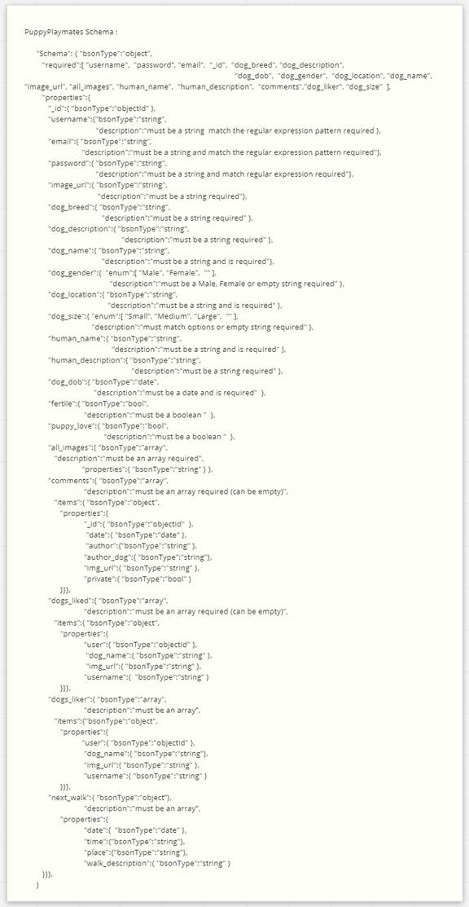
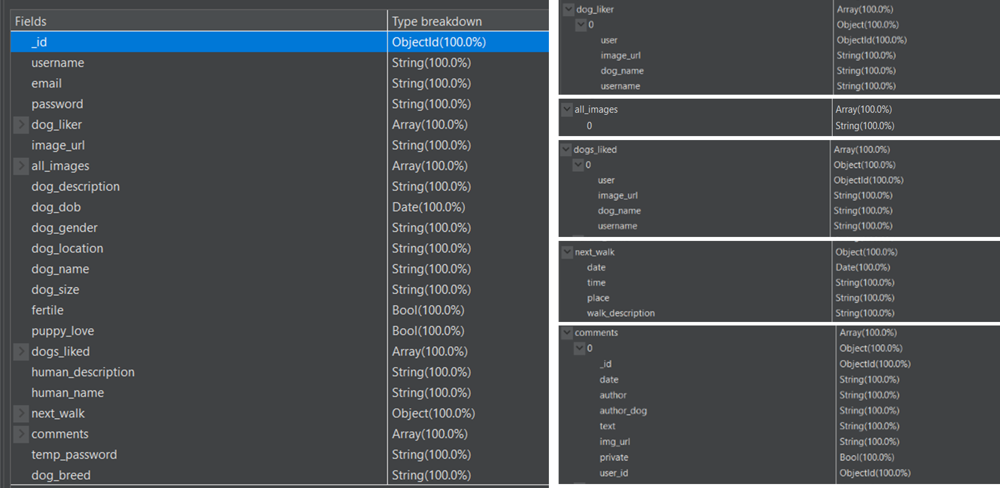
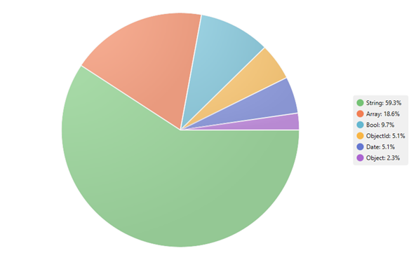
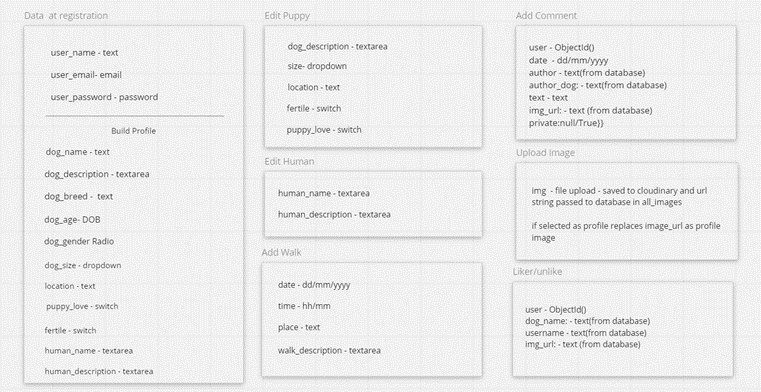
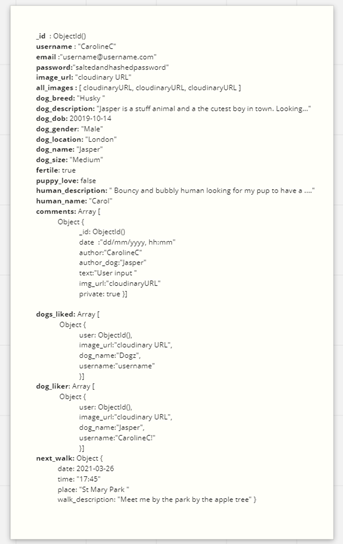
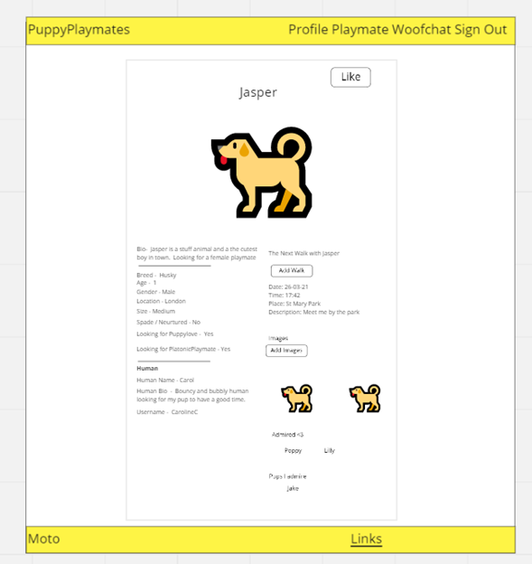
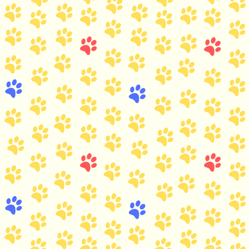
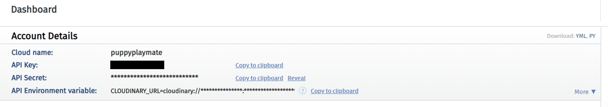
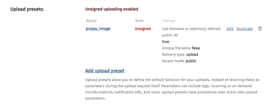
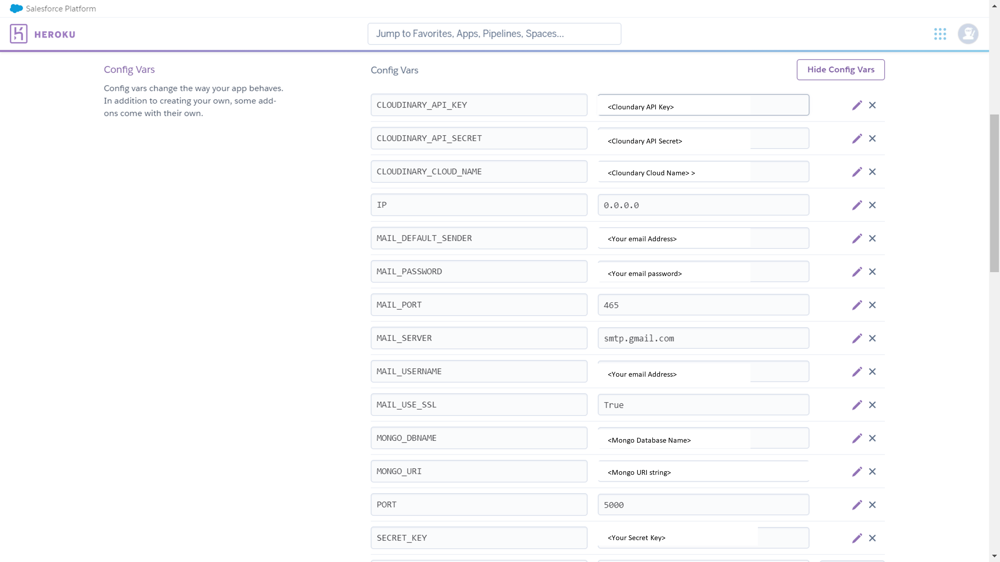

# Puppy Playmates 

[Link to Live Website](https://puppy-playmates.herokuapp.com/)

[GitHub Repo](https://github.com/crypticCaroline/puppy-playmates)

*** 

## About  
Welcome to Puppyplaymates, a webapp to help dogs find love! 
This is a Python Flask app using MongoDB, cloudinary and Flask Mail to produce a social media style application.

PuppyPlaymates currently brings users together and allows them to get in contact with the pups they love! The application lets the users create a profile that allows them to add their dogs’ details, add photos, let other users know when the next walk with their dog is happening, add comments both public and private and add likes on other profiles.  The site offers the additional functionality, reset passwords, change passwords, reporting other users, contact us, editing and deleting comments, backend validation, profanity checking and birthday checking. Please look at the [features](#features) section for a more detailed description. 
The application has a lot of room for growth and a list of future features to implement. 

## Index – Table of Contents

- [User Experience (UX)](#user-experience--ux-)
- [Strategy](#strategy)
  * [User Stories](#user-stories)
    + [New User](#new-user)
    + [Existing User](#existing-user)
    + [All Users](#all-users)
    + [Reasons for the website](#reasons-for-the-website)
- [Scope](#scope)
    + [A Playmates user may expect:](#a-playmates-user-may-expect-)
    + [What a user may want:](#what-a-user-may-want-)
    + [As a developer / business I expect:](#as-a-developer---business-i-expect-)
- [Structure](#structure)
- [Database](#database)
    + [Datebase Schema](#datebase-schema)
      - [Object Instance in the Database](#object-instance-in-the-database)
      - [Below are the user input types that the user experiences in the front end](#below-are-the-user-input-types-that-the-user-experiences-in-the-front-end)
      - [Sample of filled in Document](#sample-of-filled-in-document)
      - [Archives](#archives)
- [Validation](#validation)
  * [Backend Validation](#backend-validation)
  * [Front End Validation](#front-end-validation)
- [Security](#security)
- [Features](#features)
    + [Universal Features Across the Site](#universal-features-across-the-site)
  * [Responsiveness](#responsiveness)
  * [Accessibility](#accessibility)
  * [Flash Messages](#flash-messages)
  * [Input Fields](#input-fields)
  * [Base Templates](#base-templates)
    + [Nav](#nav)
    + [Footer](#footer)
      - [Meta data](#meta-data)
  * [Error Pages](#error-pages)
    + [404](#404)
    + [500](#500)
    + [403](#403)
    + [Not Session](#not-session)
    + [Features Specific to Pages](#features-specific-to-pages)
  * [Profile](#profile)
    + [Profile Content](#profile-content)
    + [Admin](#admin)
    + [Edit Modals](#edit-modals)
  * [Playmates](#playmates)
    + [Display](#display)
    + [Search](#search)
  * [Homepage](#homepage)
  * [Delete Account](#delete-account)
  * [Safespaces Policy](#safespaces-policy)
  * [Privacy Policy](#privacy-policy)
  * [Form Pages](#form-pages)
  * [Login](#login)
  * [Register](#register)
  * [Build Profile](#build-profile)
  * [Contact Us](#contact-us)
  * [Report User](#report-user)
  * [Reset Password](#reset-password)
  * [Change Password](#change-password)
- [Future Features](#future-features)
- [Design](#design)
- [Skeleton](#skeleton)
  * [Layout](#layout)
    + [Surface](#surface)
    + [Typography](#typography)
    + [Call to Action](#call-to-action)
  * [Imagery](#imagery)
- [Technologies](#technologies)
    + [Lanaguages & Frameworks](#lanaguages---frameworks)
    + [Front End](#front-end)
    + [Backend](#backend)
    + [Helpers](#helpers)
    + [Planning](#planning)
  * [Flask](#flask)
    + [Testing Tools](#testing-tools)
    + [Technology Configeration](#technology-configeration)
    + [MongoDB](#mongodb)
  * [Cloudinary](#cloudinary)
  * [Flask Mail](#flask-mail)
- [Testing](#testing)
- [Deployment](#deployment)
  * [Configeration](#configeration)
    + [Local Enviroment](#local-enviroment)
  * [Adding and Committing files](#adding-and-committing-files)
  * [Deploying](#deploying)
  * [Forking](#forking)
  * [Cloning](#cloning)
- [Known Bugs](#known-bugs)
- [Acknowledgements](#acknowledgements)
  * [Credit](#credit)
      - [People](#people)
      - [Additional Testers](#additional-testers)
      - [Tools and Docs](#tools-and-docs)
  * [Code:](#code-)
  * [Content:](#content-)
  * [Inspiration & Research:](#inspiration---research-)

<small><i><a href='http://ecotrust-canada.github.io/markdown-toc/'>Table of contents generated with markdown-toc</a></i></small>

*** 

## User Experience (UX)
## Strategy
With PuppyPlaymates I wanted to be able to give dog owners a way to communicate with other dog owners in a fun and safe way. By combining social media and data profile principles I have created a playmate finding service dedicated to human’s best friend.

### User Stories 

#### New User
* I would like to find out what the site is about
* I would like to see if the site is for me without registering 
* I would like to easily register 
* I would like to be able to add my dog’s details

#### Existing User
* I want to be able to sign in and out easily
* I would like to be able to delete my account
* I would like to be able to add/edit/delete comments to my own and other profiles
* I would like to be able to reset my password

#### All Users 
* I would like to get user feedback when I take actions on the site
* I would like to be able to contact PuppyPlaymates
* I would like to be able to add comments and details about my walks
* I would like to be able to track what pages I have liked and that like me
* I would like to be able to message or comment on other profiles
* I would like to feel safe when using the platform
* I would like to be able to search for other users 
* I would like to be able to add/edit/delete images and change my profile image
* I would like to be able to add/edit/delete dog information
* I would like to be able to add/edit/delete my information

#### Reasons for the website
A way to bring together dog owner for:
* Playmate finding
* Walk arranging 
* Promoting interactions between owners
*  Potential Breeding

## Scope 
#### A Playmates user may expect: 
* Easy to navigate website
* Good presentation and visually appealing
* Links and functions work as expected
* Can Add / Edit / Delete info on my profile
* Can view other dog profiles
* Can interact with other users 
* Can delete profile 
* Can get in contact with site owners 

#### What a user may want: 
* Can Add Edit/ Delete info to my profile
    * Add/Edit Dog Information 
    * Add/Edit/Delete Images
    * Add/Edit/Delete Comments
    * Add/Edit/Delete Walk Information
* Can view other dog profiles
    * Add/Edit/Delete Comments 
    * Like other users’ profiles so I can find them again
* Can report users who make me feel uncomfortable 
* Add/Edit/Delete Events (outside current scope)
* Live Chat abilities WOOFCHAT (outside current scope)

#### As a developer / business I expect:
* To provide an easy-to-use website
* To enable users to communicate
* Add/Edit/Delete Images, Comments, Walk information, profile functionality 
* To make the website fun and enjoyable
* To deliver an easy sign up and log in process
* I want to allow users to be able to reset their passwords if they forget their details
* To safeguard users’ content and only allow the author or profile owner to edit/delete content
* To safeguard users by having a report pathway and to be able to remove inappropriate comments, images, and accounts 

## Structure
The diagram below is of the information architecture of the Web App.  This shows the journeys the users can take throughout the website. Please see the [Features](#features) section for more information on what user actions are on each page 

***

## Database 
#### Database Schema 

Schema I have used for the database 
I have used a non-relational database which has meant that I have kept all of a user’s data stored within one document and used Key Value pairs with nested arrays and objects to store and access the appropriate data.  Most the data I have stored as "strings" If they are text based, all of which will have to pass through [validation](#validation), "bools" for switches, dates for DOB and Walks and ObjectIds. I have chosen to set the time of the walk and the date/time of the comments as strings this is because this information is only for user info and will serve no function in sorting through the data/time as a searchable function, this removes the need to reformat the data on entry and retrieval of the database. The nested arrays / objects are also passed through backend [validation](#validation) to ensure they fit the schema for the database. 

I have used backend validation to make sure the data is formatted correctly before being sent to the back end. Booleans are set to a default False, Dates are formatted before insertions, string fields are checked to make sure they are strings.  I ran the database through [Studio 3T](https://studio3t.com/) To check to make sure all my data was conforming to my intended Schema.

 

##### Object Instance in the Database

##### Below are the user input types that the user experiences in the front end

##### Sample of filled in Document

##### Archives

When a user is deleted, I have chosen to add them into an archive.  This means that if a user is accidentally deleted, we have the means to access the data.  The schema is identical to above and directly transferred over before the user is removed from the user’s collection.

## Validation

### Backend Validation 

All users’ inputs are passed through the appropriate validators to ensure no bad data enters the database. The users are notified through a flash message if any of these checks fails.  

Check Length - Makes sure in text fields there is a min/max length 

Check Size - checks to make sure the user’s input is "Small", "Medium" or "Large"

Check Gender - checks to make sure the user’s input is "Male" or "Female" 

Date Format - Using stringfy, if the data cannot be formatted it will throw an error and won't be able to be input to the database

Booleans - default set to False unless the switch is activated to == "on" the  bool will then be True    

Check Extension - Checks the extension of the users upload to make sure it is allowed 

Not Valid Password - Checks to make sure password matches Regular Expression 

Not Valid Username - Checks to make sure username matches Regular Expression 

Not Valid Email - Checks to make sure the email address matches an email Regular Expression

Not Valid Text - Checks to make sure the text input is not just white spaces

Profanity Checker - Looks at a predefined list of curse words to check if the user has used any. The curse words can be added to at any time. They are within the varibles.py file in the variables folder in the main folder.  

### Front End Validation 

I have used the following attributes along with the [Materialize](https://materializecss.com/) class of validate to provide the user with front end validations
* minlength
* maxlength
* min
* max
* pattern
* type 
If any of these fail the box will turn red to show that it has not met the requirements.  I have used helper text and titles on hover to help the user pass both validations. 

##  Security

Username -  The username can only exist once in the database and at registration the username is checked against the current usernames

Passwords - The password must contact a mixture of uppercase and lowercase letters, digits, and a special character. It must be at least 8 characters long.  The password is salted and hashed using from [werkzeug.security](https://werkzeug.palletsprojects.com/en/1.0.x/utils/) when it is collected from the user.

Login - At login, the user must match their username/email to the correct password.  It will check to make sure that the password the user enters meets the check_password_hash.  If successful, the user will be assigned a session cookie.  If the user is unsuccessful then they will be notified that one of the fields is incorrect.  I have chosen not to notify the user which field is incorrect so that their details remain private and are harder to guess. 

Session Cookie - The user is assigned a session cookie on successful login.  This allows the user to navigate their own profile, add edit and delete information.  The user is not able to make any changes to pages that their session cookie does not match the username.  

Reset Password - If the user tries to reset their password, they are sent an email to the email address we have on file.  They are sent a random string temporary password and a link to the reset password page.  Once they have clicked the link, they will need to enter the username attached to the email address as an extra measure. 

Data Input - In the app.py the session user is compared with the username to see if that user can make changes. 
Most functions will find the details of the document to update using the session user’s cookie. This means even if the user manages to pass the front end security, they will only end up updating their own document. 
There are a couple of exceptions for example, delete/edit comments, delete images and delete profile.  This checks to see if the user is an author of the post or admin which can remove if necessary.  

## Features

#### Universal Features Across the Site

### Responsiveness

The website is fully responsive between different screen resolutions.  I have done this by using media queries, containers, rows, and columns. I have chosen to hide the GIF images on small devices.  

### Accessibility

* Used bright colours with high contrast throughout the website.  
* Used meaningful aria-labels where appropriate to ensure ease of use with a screen reader. 
* Used auto-completes for new-password and current-password to help screen readers navigate and prompt users.  
* Used headings to help users navigate the website.  
* Ensured that the logo has an aria-label of 'Home' to make navigation easier. 

### Flash Messages
Flash messages are displayed toward the top of the pages and includes a soft pink banner to alert users to the text they contain when the  

### Input Fields 

* Text Input Fields -Type specific and have validate patterns that have to match, they are also set with min and max length to ensure that the right data is entered. I have used the materialize validate class to turn the input box green when the field is valid, else the form will not be submitted. 
* Validators - I have used back-end validation as a fail-safe to check if the input matches the same pattern on the front end.  If it does not match the pattern, then the user will get a flash message explaining that it is not a valid input.  
* Profanity - At the same time the text input is passed through a profanity checker to check from a pre-set list of words to see if any of the words match.  If they do match, then the user will get a flash message asking them to refrain from using profanity and will not submit the message to the database.
* Date – I have created a JavaScript function to check the current date and limit the date options:	
    * DOB – the dog cannot have a future Dob and I have also limited the age of the dog to 20 years 
	* Upcoming walks – can be set to have the date from today onwards but not be set in the past. 

### Base Templates 

The base template is formed of the Meta Data, Navigation, and Footer.  The block content is rendered in between the navigation and footer.  The page description is also changed for each page. 
#### Nav
The Navigation Bar is at the top of the webpage. If the user is signed in, they have navigations to their Profile Page, Playmates and Sign Out. If a user is not logged in the user will view Login and Register. All change colour when they are hovered over. The active page is slightly lighter, so the user knows what page they are on.  The nav links direct the user to the correct page of the website. When the logo is clicked on it will take the user to the homepage. 
#### Footer
The footer consists of the company moto on the left-hand side and on the right the user can find more internal links.  If the user is logged in, they will see Contact Us, Report User, Change Password, Delete Account, Privacy Policy and Safe Spaces Policy and Sign Out. If the user is not logged in, they will be able to view Contact Us, Sign In, Register, Privacy Policy and Safe Spaces Policy.  
##### Meta data
I have added keywords, author, and description to the meta data to make the website easier to find.  This increases traffic to the website.  I have also given each page a different name, so the user knows which tab they are on. 

### Error Pages 
#### 404 
* If the user is signed in, they will get a message that they are barking up the wrong tree and a button to take them back to their profile 
* If the user is not signed in the button will take them back to the homepage

#### 500 
* If there is an internal server error the user will be shown a message to say the account may no longer be active (if the account has been deleted) or the profile is incomplete if it is their own profile, and they didn't complete registration fully then they will be able to click the Build profile button to take them back to finish the set up. 
* They will also get button to take them back to their profile if they are a session user and back to the homepage if not. 

#### 403

* Access forbidden with a note to advise the user they cannot see the page
* If the user is signed in, they will get a button to take them back to their profile 
* If the user is not signed in the button will take them back to the homepage

#### Not Session 
* If the user does not have a session cookie, then they will be redirected to the log in page with a flash message advising that they need to be logged in to view that page. 

#### Features Specific to Pages
Please refer to [structure](#structure) to see the navigation and user pathways 

### Profile 
#### Profile Content
* Like/ dislike overlay gif - adds to Admire/Pups I Admire when Session User not the Profile owner 
* Birthday Display - if it is the profiles dog birthday a cake will appear in the top right of profile
* Profile Image - Displays users’ image - if profile owner when clicked toggles Edit Images Modal
* Profile Bio/ dog details: 
    * Displays user bio details - if profile owner when Edit Puppy button clicked toggles - Edit Profile Modal
    * Age is worked out from the profile users DOB and today’s date using the check_date() function.
    * If the profile owner has specified, they are looking for a romantic match for their dog it will show in the profile as looking for Puppy Love and will have an Icon of a heart. Else it will render that they are looking for platonic playmates
    * If the profile owner has had their dog neutered or spade then the template will render "I have had the snip" and a pair of scissors. Else the profile will read "I've still got all my puppy making parts"
* Profile Human - displays human info - when Edit Human button clicked toggles - Edit Human Modal
* Walks - Displays next walk - when update clicked toggles - Add Walk Modal 
* Images - user a loop to display all images in users image array
    * Lets users horizontal scroll through other users’ photos.
    * If profile owner when update images clicked toggles Edit Images Modal
    * When image clicked upon triggers a large image view in a Modal  
    * The most recent images are shown first
* Admire - displays dogs that have liked the page, adds an object containing the likers - image, name and URL to the array and then adds the profile liked to the users Pups I love. 
* Comments - uses a loop to go through the comments array in the database and shows newest at the top and adds edit and delete buttons to each comment and create individual modals dynamically 
    * Displays all comments on user profile 
    * If private only the author and user of that profile can see the message. 
    * The user of that profile can delete any message, and this will toggle delete comment Modal.  The author of the comment can edit their comments and when clicked the author can either edit or delete their own comment. The comments are displayed with the authors image, name, and a time stamp. 
* Add Comment - all users can add comments and select whether they make them a private message. 

#### Admin
* If the user is admin, they will be able to delete any comment on the site, delete images and also delete profiles if they feel like there has been inappropriate behaviour.   
* When visiting the admin profile, instead of the above there are buttons that sends the user to contact us, report and back to profile 

#### Edit Modals 

* Add Walk - brings up a form so the user can add a walk to their profile:
    * The date can only be set from today date onwards as past dates are not useful

* Edit Profile - Brings up a form to allow the user to change some of the dog’s details 
    * Not all details can be changed such as the Name, Gender and DOB as this should not change for the dog.  The user can rebuild their whole profile using the rebuild profile navigation in the footer and can also be directed to the build_profile page from the delete page where they are offered the chance to add change all the dog details.
    *  The fields are prefilled out with the users details from accessed from the database
* Edit Images 
    * Uses a loop to create a card for each image and builds a make profile picture and delete image button.
    * Enables user to upload a new image and give them the option to make it the profile image straight away – ( The image is uploaded to a cloudinary and a URL string is created and added to MongoDB)
    * The upload tab is held within a collapsible, so it doesn't take up the entire space of the modal
    * The file extension is checked prior to upload and only allow if jpg, png, gif and jpeg
    * If the image is set as the profile image, when is it deleted the default avatar replaces the profile image
    * If the image is not the profile image, then a button will appear to make it the profile image
* Edit Human - brings a form up so users can enter the human name and bio 
* Image Modal - modal which displays a larger version of the image the user had added 
* Edit Comment - allows authors to edit comments also renders a button to delete the comment as well
* Delete Comment - allows authors or profile owners to delete comment. If the profile owner, it also brings up button to report user if comment makes them feel uncomfortable. 

### Playmates 
#### Display 
* Uses a loop to build individual cards for each user containing:
    * Dog name
    * Dog profile photos
    * First 3 lines of dog description
    * If looking for love displays a heart icon
    * If neutered or spade displays a scissor icon 
    * Each card is clickable and take the user to that full profile if logged in, else send them to log in page with a flash message

#### Search  
* Allows user to search for other dogs by breed, size, location, gender, and name.

### Homepage
* Displays information about the company and the steps to create an account
* Shows a button so potential users can see the playmates section of the web app but when clicked on will prompt them to login

### Delete Account 
* Button to take user back to their profile
* Button to ask if the user wants to change their dogs’ details - this will take them back to build profile and allows the user to change all the details. 
* Button to delete their profile that triggers the modal
* Delete Modal helps to stop users accidentally deleting their accounts
*  The entire document will be added to the archives in case of accidental removal

### Safe Spaces Policy
Shows the user the company Safe Spaces Policy 

### Privacy Policy 
Shows the user the company Privacy Policy 

### Form Pages
#### Contact Us - Report User - Reset Password - Change Password - Register - Login
All the form pages have the following features:
* On a small device will show the form and fields
* On Medium and larger devices, the user will see a gif of a dog/dogs (on reset, change password, register and login)
* Each field is passed through validations both on front and backend prior to being submitted to the database

### Login
* The login page consists of the username/email and password fields
* A link to reset password 
* A link to register an account
* Checks that the login is valid and there is a profile else advises user that one or both fields are incorrect

### Register
* Create profile form - containing field for username, email, password, and repeat password.
* Checks to see if username or email already exists and will render a flask message if they do.
* Check to make sure passwords match 
* Checks validity of fields
* links and confirmation that the privacy and safeguarding policy have been agreed to
* If all valid on submit will add the user to the database, add a session cookie using the username and direct them to build their profile.

### Build Profile 
* Allows users to fill out the rest of the following dogs’ details and types:
    * Name - text - input to database as string
    * DOB
    * Size 
    * Breed
    * Preferences for platonic or love
    * Spade of Neutered 
    * Description
* Allows the user to add their own name and description
* Input fields are put through a validator to check they are acceptable and text fields are put through the profanity filter  
* The date of birth field has a date range of today and up to 20 years.  This is to stop users giving their dog a future date or a date that does not exists
* If the user has already built their profile these fields will be prefilled out, so the user doesn't have to re-enter them.    

### Contact Us
* Has a field for the email address if the user is not signed in so they can enter their email
* If the user is signed in it find their email from the database and does not display the email field
* Asks the user to enter a message.  When sent the user is sent a copy of the email to their inbox and the email is sent to PuppyPlaymates 
 
### Report User 
* Has a field for the username they are reporting 
* Asks the user to enter a message explaining what they are reporting. When sent the user is sent a copy of the email to their inbox and the email is sent to PuppyPlaymates 

### Reset Password
* Asks user for email address and send a random generated string to the user’s emails address if they are a registered user. 
* If they are not a registered user, they will receive a flash message informing them that the email address is not registered
* The random string is saved into the users document with the key to temp_password 

### Change Password
* The change password page can be accessed either through the link sent to the users email address or internally if they are signed in
* The current password field requires the user to use either the temp_password they were assigned when they reset their password or current password
*  The repeat password and new password must match
* On a successful password change the temp_password field is given a new ransom string so it cannot be used again. 

## Future Features 

Below is a list of future features I would like to add into PuppyPlaymates 

* Maps - shows dogs by nearest location on the playmates page 
* WOOFCHAT - Live chat app using web sockets, was in the original plans for playmates but outside the scope at this point
* Pagination on the playmates page 
* Preferences - multi search queries on playmates page 
* Ability to add multiple dogs to one human profile 
* Use a database call to render up to date photos on comments/ liker rather than using the image at time of posting.  
* Showcase all walk/events - option to promote your walk or keep it just on your profile  
* Keep a track of previous walks in another section of the profile page 
* Pagination for comments 
* Add a data store for all comments that are posted for safeguarding purposes.  If a user deletes or edits their comments, they will be stored on the database in a separate collection along with their username, time stamp, email address. This would be for the purpose of safeguarding so if the comments violate the safe spaces policy, then action can be taken against the user. 
* Add all deleted accounts/emails to a separate nonuser visible collection - this would give the ability to ban certain users/email addresses if policies were violated. 
* Continue working on the profanity checker

***

## Design 

## Skeleton 
Please see the [Features](#features) section for more information on what user actions are on each page 
Please refer to the [structure](#structure) to see the navigation and user pathways 

### Layout 

Initial Wireframe - 

I started working on the wireframe for the profile page first as this is where most of the site functionality would be.  The original wireframe is slightly different from the final one due to changing the WOOF Chat tab in the navigation to be comments on the user’s page instead.  This was because I decided to reduce the scope and include the live chat app functionality in a future release. 
The other difference is the size of the user’s image from spanning the entire width on desktop to taking half the width. 

Please see the [Wireframes](docs/wireframes) for the final wireframes

Please see [Site Images](docs/siteimages) for images of each page of the application

***

#### Surface 

The colours I have used in the closely resembles the colours used in the gifs/ images of the webapp.  I have chosen to go with a bright and fun colour scheme of yellow, off whites, dark blue/black, light blue, and soft pink.  The yellow and off-white colour combination of the dark blue for contrast have been used to make the features standout. Notes of slightly varying shades and opacity of blue and pink are used throughout the website to give subtle accents.  I have often used a slight difference in shade between cards and the profile containers to give a sense of depth.  

I often used the same colour as the images/gif for the background colour of elements to create a more cohesive user experience. 

#### Typography
I have chosen to use a font from Google fonts I have used Montserrat. This font is a sans serif font which means it does not have decoration at the end of the letter. This can cause issues with readability seen in serif fonts. The Montserrat font playful and offers nice spacing between the letters as standard.

For headings I have increased the letter spacing, font weight and font size to make them stand outstand out.

I imported using the following code at the top of my style.css file:

    @import url('https://fonts.googleapis.com/css2?family=Montserrat:ital,wght@0,200;0,300;0,400;0,500;0,600;0,700;0,800;1,800&display=swap');

#### Call to Action
For the buttons and links (styled as buttons) I have changed the colour on hover. This is to show the user that the button can be clicked. For edit/add/login/register/navigation I have used yellow with dark writing, when hovered the colours switch.  For the delete/remove options the button starts red with light writing and then changes to black and yellow when hovered. 

On other clickable links, cards, and images I have used a more subtle call to action where the mouse changes to a cursor pointer to show the user the element can be clicked.

For the nav bar I have used a shading on the tabs to indicate they can be clicked. 

### Imagery  

#### Background 
I designed the background image in [Canva](https://www.canva.com/) using a pawprint Icon. I have repeated this across the page and alternated the colour between a similar yellow to the navbar, blue and pink on a light-coloured background. 

#### Profile image 
I designed the default profile image using [Canva](https://www.canva.com/) I gave the cartoon a transparent background and enclosed the image within a circle. 

##### Icon
I created the Icon image in [Canva](https://www.canva.com/) using the same colours that have been used throughout the website, using the same image as the default profile image.  

##### Bullet Points
For bullet Points I have used a paw print found on [Canva](https://www.canva.com/) with a transparent background.

#### Homepage
[Homepage Image](https://www.freepik.com/free-photo/group-portrait-adorable-puppies_3532149.htm#page=1&query=puppy%20love&position=2)
For smaller devices I have cropped the image to include the first 3 dogs. 

#### Gifs
[Waiting Dog](https://dribbble.com/shots/6335402-Dog)

[Happy and Angry Dogs ](https://dribbble.com/imargarita)

[Delete Dog](https://dribbble.com/shots/4842912-Old-Dog)

[Reset Dog](https://dribbble.com/shots/3011370-This-is-my-dog-Meshi)

[Break Dancer(Human)](https://dribbble.com/shots/13996136-Breakdance)

[Dog Walk](https://dribbble.com/shots/7189098-Walking-dog)

[Group Dogs](https://dribbble.com/shots/6539601-)

[Space Puppy](https://dribbble.com/shots/4382758-Puppy-Day)

#### Error Pages
[Dog Barking](https://dribbble.com/shots/2652719-barking-up-the-wrong-tree)

## Technologies
#### Languages & Frameworks 
* HTML5 - Mark-up language using semantic structure.
* CCS3 - Cascading style sheet used to style.
* JavaScript - Programming language.  
* Python - Programming language
* [Flask](#flask) - Framework + Extensions
* [Materialize](https://materializecss.com/) - CSS Framework for structure, buttons, and some styling
* [jQuery](https://jquery.com/) - Materialize initialising
* Gitpod.io - for writing the code. Using the command line for committing and pushing to Git Hub
* GitHub - hosting repositories
* GIT - Pushing code to repositories

#### Front End
* [Google fonts](https://fonts.google.com/)  - for the font
* [Font Awesome](https://fontawesome.com/) - for icons used
* [Canva](https://www.canva.com/)-Designing the background, default image and Icon

#### Backend 
* [MongoDB](https://www.mongodb.com/)
* [Heroku](https://dashboard.heroku.com/)
* [Cloudinary](https://cloudinary.com/)

#### Helpers
* [Beautifier](https://beautifier.io/) - for helping to keep code tidy 
* [Random Key Gen](https://randomkeygen.com/)
* [Power Mapper](https://www.powermapper.com/) to check for browser compatibility
* [Temp Mail](https://temp-mail.org/en/)

#### Planning
[Miro](https://miro.com/app/dashboard/) - for planning of site flow, creating wire frames and general mind mapping

### Flask
The application was built using the [Flask](https://flask.palletsprojects.com/en/1.1.x/) Framework which is reliant on the [Jinja](https://www.palletsprojects.com/p/jinja/) templating language. The application was written in python. 

I used the following Extensions:
* [Flask Mail](https://pythonhosted.org/Flask-Mail/) - For emailing users
* [Flask-PyMongo](https://flask-pymongo.readthedocs.io/en/latest/) - For interacting with the MongoDB database
* [Werkzeug](https://werkzeug.palletsprojects.com/en/1.0.x/utils/) - For providing security’s, password_hash, check_password_hash

#### Testing Tools
* [HTML Validator](https://validator.w3.org/) - checking the validity of code
* [CSS Validator](https://validator.w3.org/) - checking the validity of code
* [JSHint](https://jshint.com/)- Testing and checking JS.  - checking for errors in code
* [Pep8 Online](http://pep8online.com/) - Testing and checking PEP8 compliance 
* [Am I Responsive](http://ami.responsivedesign.is/#) - checking whether the site is responsive. 
* [Internet Marketing Ninjas](https://www.internetmarketingninjas.com/online-spell-checker.php) - spell check
* [Python Tutor](http://pythontutor.com/) - For function testing 
* [Studio 3T](https://studio3t.com/) - Testing Database Schema 
* [Regrex101](https://regex101.com/r/OnE0BG/1/) - Testing Regrex Patterns
* DEV Tools - Lighthouse

***
#### Technology Configuration

#### MongoDB 

[MongoDB](https://www.mongodb.com/) was used as the database to store the users details to set up MongoDB follow the steps below

* Sign up to MongoDB
* Create a new shared Cluster
*  Select a Cloud provider and region (I used AWS and Ireland)
* For free use  m0 cluster tier
* Give your cluster a name
* Go to collections and add a database
* Go to database access and add a username and password

Connecting - via application
* Go back to the cluster overview
* Click the CONNECT button.
* Select 'connect your application'
* Select your language/ driver (I used Python 3.6 or later)
* Copy the connection string and change the details. 
* Set the cluster name, collection name, URI connection string and password as environmental - see [Configuration](#Configeration) to set up your application configurations

### Cloudinary 
[Cloudinary](https://cloudinary.com/) is an Upload API and image store
I added cloudinary to my application using the following steps:
* Create a Cloudinary Account, I called mine PuppyPlaymates
* Configure your env.py file with the Cloud name, API Key and API Secret - see [Configuration](#Configeration) to set up your application configurations

* Set up a folder to store your images, I called mine user_images
* Go to settings in the top right 
* Click the upload section in settings:
    * Create an upload preset with a name of your choice
    * Set it as unsigned
    * Use filename or externally defined public ID : true 
    * Unique filename: false 
    * Delivery type: 
    * Upload Access mode: public

    

When a user uploads, I used the following code to create the correct path and upload to cloudinary. I have chosen to transform all the files to a low-quality image to reduce the rendering time. 
        
        filename = secure_filename(item.filename)
        filename, file_extension = os.path.splitext(filename) 
        public_id = (<username> + '/q_auto:low/' + <filename>)

        cloudinary.uploader.unsigned_upload(
                            item,
                            <upload_preset>,
                            cloud_name=<cloud_name>,
                            folder='/user_images/',
                            public_id=public_id)

I then saved the full URL for that image into the MongoDB database.  I saved the base cloudinary URL in my variables folder and added the public_id to the end. The base URL is in the dashboard of your cloudinary account. I specified the folder in my URL string 

        cloudinary_url = ('https://res.cloudinary.com/puppyplaymate/image/upload/user_images/')

### Flask Mail 
I have chosen to use Gmail as my mail provider alongside [Flask Mail](https://pythonhosted.org/Flask-Mail/) to send mail to users from within the app. 
You will need to ensure you set your email provider up  to Allow less secure apps otherwise Gmail will block you being able to send/receive emails through the application.  
You will also need to enable IMAP as well.  You can find some helpful tips [Flask Mail Help](https://www.twilio.com/blog/2018/03/send-email-programmatically-with-gmail-python-and-flask.html)
I have used Gmail’s smtp server.  -  see [Configuration](#Configeration) to set up your application configurations

## Testing 

[TESTING DOC ](docs/testing.md)

Please see the testing document for Testing

## Deployment 

### Configuration 
Beneath your imports you will need to configure your app.py file.  You will need to import your local env.py for local environments.  For [configuration for Heroku](#deploying). 

Configure as follows:

        if os.path.exists('env.py'):
            import env

        app = Flask(__name__)

        app.config['MONGO_DBNAME'] = os.environ.get('MONGO_DBNAME')
        app.config['MONGO_URI'] = os.environ.get('MONGO_URI')
        app.secret_key = os.environ.get('SECRET_KEY')
        cloudinary.config(
            cloud_name=os.environ.get('CLOUDINARY_CLOUD_NAME'),
            api_key=os.environ.get('CLOUDINARY_API_KEY'),
            api_secret=os.environ.get('CLOUDINARY_API_SECRET')
        )

        app.config['MAIL_SERVER'] = os.environ.get('MAIL_SERVER')
        app.config['MAIL_PORT'] = os.environ.get('MAIL_PORT')
        app.config['MAIL_USE_SSL'] = os.environ.get('MAIL_USE_SSL')
        app.config['MAIL_USERNAME'] = os.environ.get('MAIL_USERNAME')
        app.config['MAIL_PASSWORD'] = os.environ.get('MAIL_PASSWORD')
        app.config['MAIL_DEFAULT_SENDER'] = os.environ.get('MAIL_DEFAULT_SENDER')

        mongo = PyMongo(app)
        mail = Mail(app)

To start your application, you will need to user the following at the bottom of your app.py file. You will need to ensure that debug=False prior to deployment.

        if __name__ == '__main__':
            app.run(host=os.environ.get('IP'),
                    port=int(os.environ.get('PORT')),
                    debug=False)

You will need to add a Procfile and ensure your requirements.txt are up to date. 
In your root folder in the terminal type - touch Procfile -  this will create a Procfile
Add the following with the following 
    web: python app.py

To install the requirements.txt use the following command in the terminal command line
    pip3 install -r requirements.txt

#### Local Environment
Create env.py file in the same file system.  In your route folder type - touch env.py - to create the file. 
Your virtual configurations should look similar to this. You will need to create a SECRET_KEY and input the IP and PORT settings. I used [Random Key Gen](https://randomkeygen.com/).

        import os

        # App config
        os.environ.setdefault("IP", "0.0.0.0")
        os.environ.setdefault("PORT", "5000")
        os.environ.setdefault("SECRET_KEY", "<Your secret key>")

        # MongoDB config
        os.environ.setdefault(
            "MONGO_URI", "mongodb+srv://<user>:<password>@<project>.af8bz.mongodb.net/<database>?retryWrites=true&w=majority")
        os.environ.setdefault("MONGO_DBNAME", "<database>")

        # Cloudinary config
        os.environ.setdefault("CLOUDINARY_CLOUD_NAME", "<Your cloud name>")
        os.environ.setdefault("CLOUDINARY_API_KEY", "<Your API Key>")
        os.environ.setdefault("CLOUDINARY_API_SECRET", "<Your Secret Key>")

        # Mail config
        os.environ.setdefault('MAIL_SERVER', 'smtp.gmail.com')
        os.environ.setdefault("MAIL_PORT", "465")
        os.environ.setdefault("MAIL_USE_SSL", "True")
        os.environ.setdefault("MAIL_USE_TLS", "False")
        os.environ.setdefault("MAIL_USERNAME", "<Your email>")
        os.environ.setdefault("MAIL_PASSWORD", "<Your email password>")
        os.environ.setdefault("MAIL_DEFAULT_SENDER", "<Your email>")

### Adding and Committing files

To add files to the repository, take the following steps

In the command line type -
        git add .  
        git commit -m "This is being committed"
        git push

To add all new files or modified file use " ."  - To add a single file, use the pathway to the file eg .index.html  or assets/css/style.css
When committing make sure your comments are clear about what changes have been made. 
Pushing will send your work to the repository

### Deploying 
Requirements for deploying:
* Cloudinary Account
* MongoDB Account
* Heroku Account
* Email account

Deploying to [Heroku](https://dashboard.heroku.com/)

* You will need to sign up to [Heroku](https://dashboard.heroku.com/)
* Once logged in click the create new app button
* Select the region closest to you and give the APP a name
* Set your deployment method to 'GitHub'
* Connect to GitHub and login
* Search for the repository you wish to deploy from
* You will need to head to settings and click 'Config Vars'
    * You will now need to set up your Configuration Vars the same way as you did for your env.py
    
* Make sure you have set up your Procfile and you have updated the requirements.txt prior to deploying    
* Click the deploy tab and go to manual deploy
* Select the branch you wish to deploy and deploy the application
* Once it is deployed you will be able to view the app
* You can set it to automatically deploy every time you push to the repository by enabling the Automatic deploys

### Forking

Forking the GitHub Repository

By forking the GitHub Repository, you can make a copy of the original repository in your own GitHub account.  This means we can view or make changes without making the changes affecting the original.

* Log into GitHub and locate the GitHub Repository.
* At the top of the Repository there is a "Fork" button about the "Settings" button on the menu.
* You should now have a new copy of the original repository in your own GitHub account.
* You will need to install the requirements.txt using the following command the command line
        pip3 install -r requirements.txt
* You will need to set up your local environments and key value pairs for deployment

### Cloning 

Making a Local Clone

* Log into your GitHub then find the gitpod repository
* Under the repository name there is a button that says, "Clone or download". Click on this button.
* If cloning with HTTPS "Clone with HTTPS", copy this link.
* Open Gitbash
* Change the current working directory to the location where you want the cloned directory to be.
* Type git clone, and then paste the URL you copied earlier.

        $ git clone https://github.com/YOUR-USERNAME/YOUR-REPOSITORY
        Press - Enter- Your local clone will be created.
        $ git clone https://github.com/YOUR-USERNAME/YOUR-REPOSITORY
                > Cloning into `CI-Clone`...
                > remote: Counting objects: 10, done.
                > remote: Compressing objects: 100% (8/8), done.
                > remove: Total 10 (delta 1), reused 10 (delta 1)
                > Unpacking objects: 100% (10/10), done.
[Click Here](https://docs.github.com/en/free-pro-team@latest/github/creating-cloning-and-archiving-repositories/cloning-a-repository) for more info on cloning. 

You will need to install the requirements.txt using the following command the command line
        pip3 install -r requirements.txt
* You will need to set up your local environments and key value pairs for deployment and running the application in your local environment. 

## Known Bugs 

Using the [Materialize](https://materializecss.com/) validate class it validates the field on focus out rather than on change.  With more time I would write my own validation class to work on change or key up so the fields would validate quicker for the user. 

***

## Acknowledgements
### Credit

##### People 
* Brian Macharia- Mentor support, guidance, tips, and key things to look out for throughout the project. Helping me to check for errors and looking at my code. 
* Matt Rudge - Template for gitpod.io 
* Anthony Lomax - Code Review, Testing, and support
* Callum Hewitt - Testing website, review, inspiration, and discussions
* Rob Beaney - Front End recommendations and discussions 

##### Additional Testers
* William Hone
* Harry Smith
* David Savage
* Ciaran Concannon
* Coding Novas Team 
* Double Shamrock Team

##### Tools and Docs
* [Code Institute SampleREADME](https://github.com/Code-Institute-Solutions/SampleREADME)
* [Code Institute README Template](https://github.com/Code-Institute-Solutions/readme-template)
* [W3schools](https://www.w3schools.com/) - for various code information and trouble shooting.
* [solution to truncate found here](https://stackoverflow.com/questions/11989546/wrap-a-text-within-only-two-lines-inside-div) 
* [Help to build age check](https://www.geeksforgeeks.org/python-program-to-calculate-age-in-year/)
* [GitHub Emoji for Markdown](https://gist.github.com/rxaviers/7360908)
* [Flask Mail Help](https://www.twilio.com/blog/2018/03/send-email-programmatically-with-gmail-python-and-flask.html)

For all technologies used head to [Technologies](#technolgies)

*** 

### Code: 
I have used Materialize for some of my front-end styling and JavaScript. 
Please see the code below it initialise the Materialize functions using jQuery altered 

    $(document).ready(function () {
        $(".button-collapse").sideNav();
        $('select').material_select();
        $('.chips').material_chip();
        $('.collapsible').collapsible();
        $('.modal').modal({
            // inDuration: 500
        });
        $('.datepicker').pickadate({
            selectMonths: true, // Creates a dropdown to control month
            selectYears: 15, // Creates a dropdown of 15 years to control year,
            today: 'Today',
            clear: 'Clear',
            close: 'Ok',
            closeOnSelect: false, // Close upon selecting a date,
            container: undefined, // ex. 'body' will append picker to body
        });

    });

### Content:
I asked users to create profile, most of the profiles have been created by test users, friends, and family. The images they have used are of their own dogs or from the internet. 

Code & Content (not already attributed): Rebecca Kelsall

### Inspiration & Research: 

