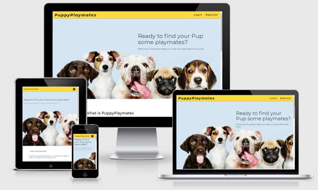
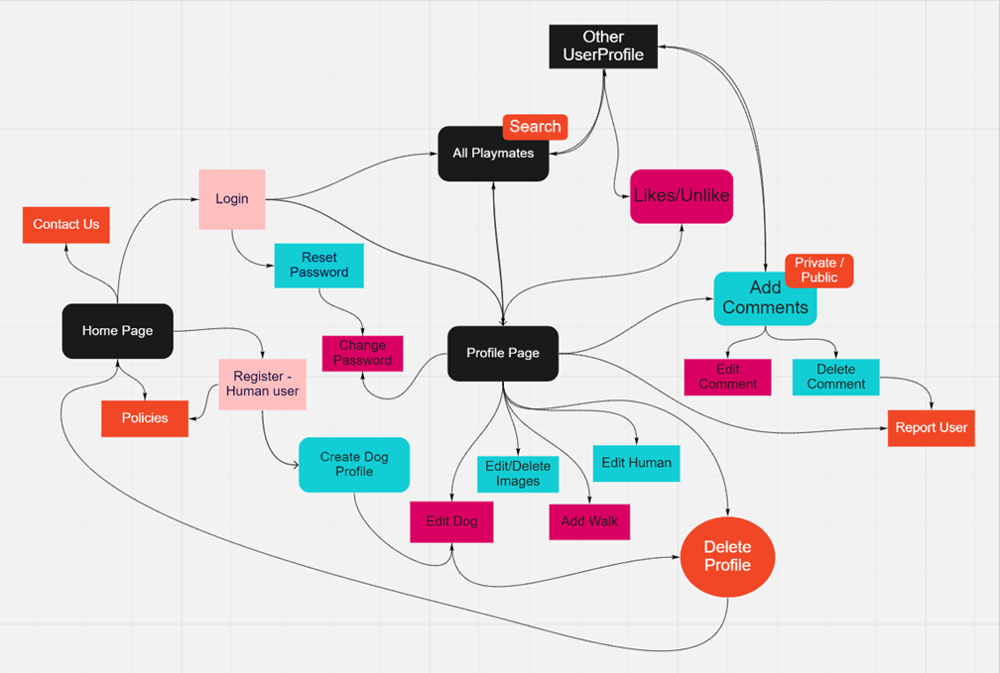

## Currently still under development and in testing

# Puppy Playmates 

[Link to Live Website](https://puppy-playmates.herokuapp.com/)

[GitHub Repo](https://github.com/crypticCaroline/puppy-playmates)

*** 

## About  

Welcome to Puppyplaymates, a webapp to help dogs find love! 
This is a Python Flask app using MongoDB, cloudinary and Flask Mail to produce a social media style application.

PuppyPlaymates currently brings users together and allows them to get in contact with the pups they love! The application lets the users create a profile that allows them to add their dogs details, add photos, let other users know when the next walk with their dog is happening, add comments both public and private and add likes on other profiles.  The site offers the additional functionality, reset passwords, change passwords, reporting other users, contact us, editing and deleting comments, backend validation, profanity checking and birthday checking. Please take a look at the [features](#features) section for a more detailed description. 

The application has a lot of room for growth and a list of future features to implement. 

## Index – Table of Contents

* [User Experience (UX)](#user-experience) 
* [Features](#features)
* [Designs](#designs)
* [Technologies Used](#technologies-used)
* [Testing](#testing)
* [Known Bugs](#known-bugs)
* [Deployment](#deployment)
* [Acknowledgements](#credit)

*** 

## User Experience (UX)
## Strategy

With PuppyPlaymates I wanted to be able to give dog owners a way to communicate with other dog owners in a fun and safe way. By combining social media and data profile principles I have created a playmate finding service dedicated to mans best friend.

### User Stories 

#### Reasons a user may visit the website
* A dog owner is looking for a playmate for their dog
* A dog owner is looking to chat to other dog owners
* A dog owner is looking to find puppy love for their dog

#### Reasons for the website
* A way to bring together dog owner for :
    * Playmate finding
    * Walk arranging 
    * Talking
    * Potential Breeding

  

## Scope 
#### A Playmates user may expect: 
* Easy to navigate website
* Good presentation and visually appealing
* Links and functions work as expected
* Can Add / Edit / Delete info on my profile
* Can view other dog profiles
* Can interact with other users 
* Can delete profile 
* Can get in contact with site owners 

#### What a user may want 
*Can Add Edit/ Delete info to my profile
    * Add/Edit Dog Infomation 
    * Add/Edit/Delete Images
    * Add/Edit/Delete Comments
    * Add/Edit/Delete Walk Infomation
* Can view other dog profiles
    * Add/Edit/Delete Comments 
    * Like other users profiles so I can find them again
* Can report users who make me feel uncomfortable 

#### As a developer / business I expect
* To provide an easy to use website
* To enable users to communicate
* Add/Edit/Delete  Images, Comments, Walk information

## Structure

## Designs

## Surface

#### Colour

#### Typography 

#### Call to Action

### Imagery   

***

## Skeleton 

### Layout 

#### Homepage Wire Frame 

***

### Mockup
#### Home Page

#### Resources Page

## Features

#### Universal Features Across the Site

###### Logo and Navigation Bar
The Navigation Bar is at the top of the webpage. The logo and nav links all change colour when they are hovered over. The active page is set to pink, so the user knows what page they are on.  The nav links direct the user to the correct page of the website. When the logo is clicked on it will take the user to the home page. 

###### Responsiveness

The website is fully responsive between different screen resolutions.  I have done this by using media queries.  I have changed the width and included content within containers so that everything stays neat and in the correct order.  The test can be taken on a phone although it has been designed for large screens to mimic real word working conditions. 

###### Accessibility

###### Input Fields 

* The email input fields are type specific, so will need to have a valid email and text, they are also set to be required in order for the user to submit. 
* The calculator is number specific so users can not enter anything other than a number. 

###### Footer 

The Footer is split into three sections, an opening hours, copyright and contact. Although this is a testing website rather than a business users may want to get in contact with the website developers to let them know of any bugs or to ask questions about visual stress.   

##### Meta data

I have added keywords, author and description to the meta data to make the website easier to find.  This increases traffic to the website.  I have also given each page a different name, so the user knows which tab they are on. 

##### Redirect

Using app@route rendering templates 

*** 

profanity 

birthday 

#### Features Specific to Pages

###### Email

### Future Features 

Maps - shows dogs by nearest location 
multiple dogs
use a database call to render up to date comment photos 
preferences - multi search queries 
all walk/events
maps 
***

## Technologies Used 

* HTML5 - Mark-up language using semantic structure.
* CCS3 - Cascading style sheet used to style.
* JavaScript - Programming language.  
* python
* flask 
* Gitpod.io - for writing the code. Using the command line for committing and pushing to Git Hub
* GitHub - hosting repositories
* GIT - Pushing code to repositories
 
Design 

Front End
* [Google fonts](https://fonts.google.com/)  - for the font
* [Balsamiq wireframe](https://balsamiq.com/)  - for creating the wireframes
* [Beautifer](https://beautifier.io/) - for helping to keep code tidy

Backend 
https://miro.com/app/board/o9J_lTewBto=/
mongodb
herouku 
Testing 
* [HTML Validator](https://validator.w3.org/) - checking the validity of code
* [CSS Validator](https://validator.w3.org/) - checking the validity of code
* [JSHint](https://jshint.com/)- Testing and checking JS.  - checking for errors in code
* [Am I Responsive](http://ami.responsivedesign.is/#) - checking whether the site is responsive. 
* [Wave](https://wave.webaim.org/) - accessibility testing
* [Internet Marketing Ninjas](https://www.internetmarketingninjas.com/online-spell-checker.php) - spell check
* DEV Tools - Lighthouse

***

## Testing 

[TESTING DOC ](readme_docs/testing.md)

Please see the testing document for Testing logs 

## Deployment 

### Adding and Committing files

To add files to the repository take the following steps

In the command line type -
        git add .  
        git commit -m "This is being committed"
        git push

To add all new files or modified file use " ."  - To add a single file use the pathway to the file eg .index.html  or assets/css/style.css
When committing make sure your comments are clear about what changes have been made. 
Pushing will send your work to the repository

### Deployment 

The project was deployed with the following steps

### Forking

Forking the GitHub Repository

By forking the GitHub Repository, you can make a copy of the original repository in your own GitHub account.  This means we can view or make changes without making the changes affecting the original.

* Log into GitHub and locate the GitHub Repository.
* At the top of the Repository there is a "Fork" button about the "Settings" button on the menu.
* You should now have a new copy of the original repository in your own GitHub account.

### Cloning 

Making a Local Clone

* Log into your GitHub then find the gitpod repository
* Under the repository name there is a button that says "Clone or download". Click on this button.
* If cloning with HTTPS "Clone with HTTPS", copy this link.
* Open Gitbash
* Change the current working directory to the location where you want the cloned directory to be.
* Type git clone, and then paste the URL you copied earlier.

        $ git clone https://github.com/YOUR-USERNAME/YOUR-REPOSITORY
        Press - Enter- Your local clone will be created.
        $ git clone https://github.com/YOUR-USERNAME/YOUR-REPOSITORY
                > Cloning into `CI-Clone`...
                > remote: Counting objects: 10, done.
                > remote: Compressing objects: 100% (8/8), done.
                > remove: Total 10 (delta 1), reused 10 (delta 1)
                > Unpacking objects: 100% (10/10), done.
[Click Here](https://docs.github.com/en/free-pro-team@latest/github/creating-cloning-and-archiving-repositories/cloning-a-repository) for more info on cloning. 

## Known Bugs 

***

## Acknowledgements

### Credit

* Brian Macharia- Mentor support, guidance, tips, and key things to look out for throughout the project. Helping me to check for errors and looking at my code. 
* Matt Rudge - Template for gitpod.io 
* [Code Institute SampleREADME](https://github.com/Code-Institute-Solutions/SampleREADME)
* [Code Institute README Template](https://github.com/Code-Institute-Solutions/readme-template)
* [W3schools](https://www.w3schools.com/) - for various code information and trouble shooting.
* [Google fonts](https://fonts.google.com/) - CDN for the fonts were used in the project.
* [Balsamiq wireframe](https://balsamiq.com/) - To build wireframes in the design phase. 
* [HTML Validator](https://validator.w3.org/) - Testing validity of HTML.
* [CSS Validator](https://jigsaw.w3.org/css-validator/#validate_by_input) -Testing validity of CSS.
* [JSHint](https://jshint.com/)- Testing and checking JS. 
* [Am I Responsive](http://ami.responsivedesign.is/#) - Checking the responsive nature.
* [Beautifer](https://beautifier.io/) - Allowing me beautify my code.
* [HTML Online](https://html-online.com/articles/smart-404-error-page-redirect/) - Redirect page Inspiration
* [Coolors](https://coolors.co/palettes/trending) - colour inspiration
* [Internet Marketing Ninjas](https://www.internetmarketingninjas.com/online-spell-checker.php) - spell check
* /* solution to truncate found here-  https://stackoverflow.com/questions/11989546/wrap-a-text-within-only-two-lines-inside-div */

*** 

### Code:

### Content:

Code & Content (not already attributed): Rebecca Kelsall

### Inspiration & Research: 

