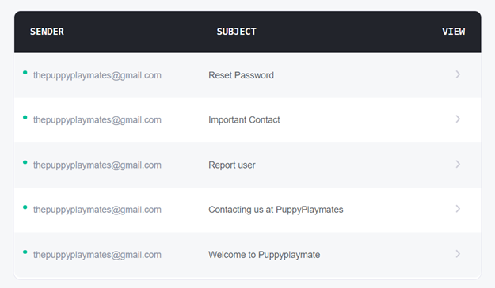
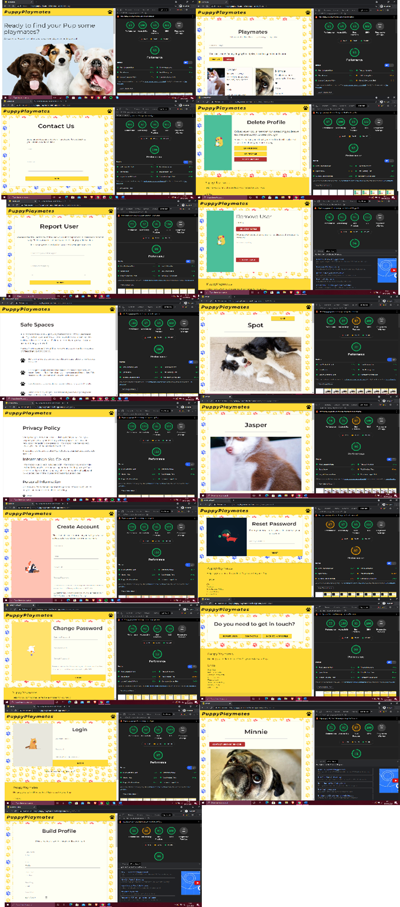
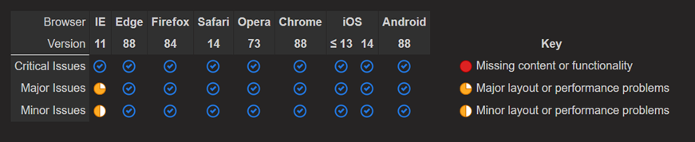

*** 

## Testing Index 
- [User Stories](#user-stories)
    + [New User](#new-user)
    + [Existing User](#existing-user)
    + [All Users](#all-users)
- [Email Testing](#email-testing)
- [Function Testing](#function-testing)
- [Regrex Testing](#regrex-testing)
- [Code Validators](#code-validators)
- [Schema Testing](#schema-testing)
- [Performance Testing](#performance-testing)
- [Browser & OS Compatibility](#browser---os-compatibility)
    + [Testing for Responsiveness](#testing-for-responsiveness)
- [Usability](#usability)
  * [User Testing](#user-testing)
- [User Feedback Testing Log](#user-feedback-testing-logs)

## User Stories

For full test of user stories please see the video  :arrow_forward: :link:

 

***

#### New User
* I would like to find out what the site is about - About Section on Homepage :heavy_check_mark:
* I would like to see if the site is for me without registering - Playmates Link at the bottom of the homepage :heavy_check_mark:
* I would like to easily register - Registration page :heavy_check_mark:
* I would like to be able to add my dog’s details - Build Profile Page :heavy_check_mark:

#### Existing User
* I want to be able to sign in and out easily - Login Page :heavy_check_mark:
* I would like to be able to delete my account - Delete Page :heavy_check_mark:
* I would like to be able to add/edit/delete comments to my own and other profiles - Add comments on profiles pages with options to edit and delete :heavy_check_mark:
* I would like to be able to reset my password - Reset password page :heavy_check_mark:

#### All Users 
* I would like to get user feedback when I take actions on the site - all pages :heavy_check_mark:
* I would like to be able to contact PuppyPlaymates - contact and report pages :heavy_check_mark:
* I would like to be able to add comments and details about my walks - Walks modal on profile page :heavy_check_mark:
* I would like to be able to track what pages I have liked or that like me - Pups I love and Admirers section :heavy_check_mark:
* I would like to be able to message or comment on other profiles - Add Comments on profiles pages with options to edit or delete :heavy_check_mark:
* I would like to feel safe when using the platform - report pages and admin :heavy_check_mark:
* I would like to be able to search for other users - Search option in playmates pages  :heavy_check_mark:
* I would like to be able to add/edit/delete images and change my profile image - Add images modal, with options to change profile picture or delete image :heavy_check_mark:
* I would like to be able to add/edit/delete dog information - Build profile page, edit info and delete profile :heavy_check_mark:
* I would like to be able to add/edit/delete my information - Build profile page, edit human and delete profile  :heavy_check_mark:

***

## Email Testing

I have used [Temp Mail](https://temp-mail.org/en/) for part of my user testing so I could create multiple profiles at a time to test the interactions between the accounts.  This also meant I was able to check that each email was being sent correctly. 

***

## Function Testing

Every function written was passed individually through a [Python Tutor](http://pythontutor.com/), I assigned input variables stepped through each line of code to ensure expected outcomes.  

I paid particular attention to the backend validation when testing my functions and tried to use different data types at input to test whether they would pass.  

***

## Regrex Testing

I checked the integrity of my Regrex pattern on my backend by passing each pattern into [Regrex101](https://regex101.com/r/OnE0BG/1/) and running a series of random checks through it. 

***

## Code Validators

Every page of the website was run through [HTML Validator](https://validator.w3.org/) because of flask being a templating language the code would not show as valid html. I copied the code from within DEV Tools and pasted it into the validators to check the validity at render. - All pages :heavy_check_mark:

I passed the CSS file through [CSS Validator](https://jigsaw.w3.org/css-validator/#validate_by_input) - :heavy_check_mark:

Every Python file has been run through to check for Pep8 compliances and to test the validity of the code. [Pep8 Online](http://pep8online.com/) - :heavy_check_mark:

The JavaScript file has been run through a JavaScript to test the validity of the code. [JSHint](https://jshint.com/) - :heavy_check_mark:

:heavy_exclamation_mark: Exception to testing above -  The select feature does not pass the HTML validation. This is a Materialize class and not my own code that is causing this issue.  I have done thorough testing manually on the select feature to ensure it does not impact user experience. 

## Schema Testing 
I used [Studio 3T](https://studio3t.com/) to run an analysis on my database to ensure that the data was of the correct type. 

## Performance Testing
I passed every page through Dev Tools Lighthouse to check to see how well the website was functioning. A few things were flagged and changed during this round of the testing.  

*** 

## Browser & OS Compatibility

Tested on Chrome, Firefox, Opera, Brave, Internet Explorer, Microsoft Edge, Safari.  iOS, Android 10, and Windows 10.  I used a combination of manual browser checks and used [PowerMapper](https://www.powermapper.com/) to check for browser compatibility.  Internet Explorer is the only browser that has shown issues with compatibility. As internet explorer is a much older browser with limited support, I have chosen not make changes for this release.

#### Testing for Responsiveness 
I manually tested the responsiveness of the app by testing every page on my Android.  I asked a friend with an iPhone to check the site on their IOS  :heavy_check_mark:

Please see [Mobile Site Images](images/mobile-images) for images of each page of the application from a mobile view

***

## Usability 

### User Testing 
I manually tested all the following calls to action:
* Buttons on hover :heavy_check_mark:
* Clicking Buttons :heavy_check_mark:
* Page Navigation in Nav and Footer :heavy_check_mark:
* External Links opening a new tab :heavy_check_mark:
* Privacy and Safe Spaces Policy opens in a new tab :heavy_check_mark:
* Validation for inputs :heavy_check_mark: 
* Submitting Forms :heavy_check_mark:
* Sideways scroll on images :heavy_check_mark:
* Modal Triggers :heavy_check_mark:
* Liking and Unlikely Dogs :heavy_check_mark:
* Adding/Editing/Deleting Images/Comments/Walks/Info :heavy_check_mark:
* Creating a Profile :heavy_check_mark:
* Login and Log out :heavy_check_mark:
* Contact Us/Report User :heavy_check_mark:
* Searching the users :heavy_check_mark:

## User Feedback Testing Logs
I put the site out to a small group of users to feedback on how they found the application.  Please see the logs below to see what feedback was received and how this feedback was used in the testing process

| Feedback  |Investigation | Fix |   Decision |   
|---|---|---|---|
|  Can't remember if Name and About were options on signup, I feel like I put dummy data in here? |  Hadn’t included human in the profile set up, users expected it |  Added these fields in the build profile part of the site |  :heavy_check_mark: |   
| The line remains yellow "as if indicating the password doesn’t match  | Goes green when you click somewhere else on the page but not key up  |  Could write a function to change the Materialize class to work on key up | Could be used added in a future release  |   
|  Special character for password: I would mention which ones are allowed as I think the - might not be working, I tried different passwords before I could be accepted |  Present, no way for users to know which character are accepted  |  Added helper text including the characters needed for password validation |  :heavy_check_mark:  |   
| Instinctively I wanted to click on the image placeholder to add the image of my dog  |  Images were only unloadable from the edit images button | Changed so that containing image and content is an anchor  | :heavy_check_mark: |   
|  No safari just did not work for me |  Tried passing through a safari test environment and could find the same bug | Asked user to try again to see if problem persisting   |  :question: Still ongoing |   
|  If I go to edit my pup, I had clicked he had been neutered but it did not bring back the original setting so when I clicked update it changed it, so he had not been neutered |  Form was not inheriting values from the data base |  Added a switch statement in the template to toggle the switch accordingly |  :heavy_check_mark:|   
| On the calendar for a date of birth I can added a future date, and as a result I got Age of -1  | Lack of defensive programming  |  Create a function to find todays date and set the min/max dates | :heavy_check_mark: |   
|  On mobile when the menu is open, there is a weird dark overlay at the bottom, that appears only if you click on the menu if you are at the bottom of the page(footer level) | Was showing on some displays  | Hidden the overlay so that it does not interfere with the UI  | :heavy_check_mark: |   
|  When I went to the list of playmates, it only allows me to click on a profile only if  hover on top of the dog's name. At the beginning, I was trying to click the image, I thought it was a bug |  Currently name was used as an anchor tag  | Change to make the whole card a clickable link  |  :heavy_check_mark: |   
|  With the comments, what is the purpose of me putting a comment on my own dog? Is this intentional? | Comments are allowed for both guests and profile  |  Add helper text to also reassure profile owner that they can comment on own profile with updates |   |   
|  Perhaps it would be nice to have a dropdown menu which takes the values from your database for the breeds etc | Currently the search is text based  |  Could add a database for different dog breeds allowing for a check list of breeds, however this is an extension of scope | May be implemented in future feature  |   
|   |   |   |   |   

***
